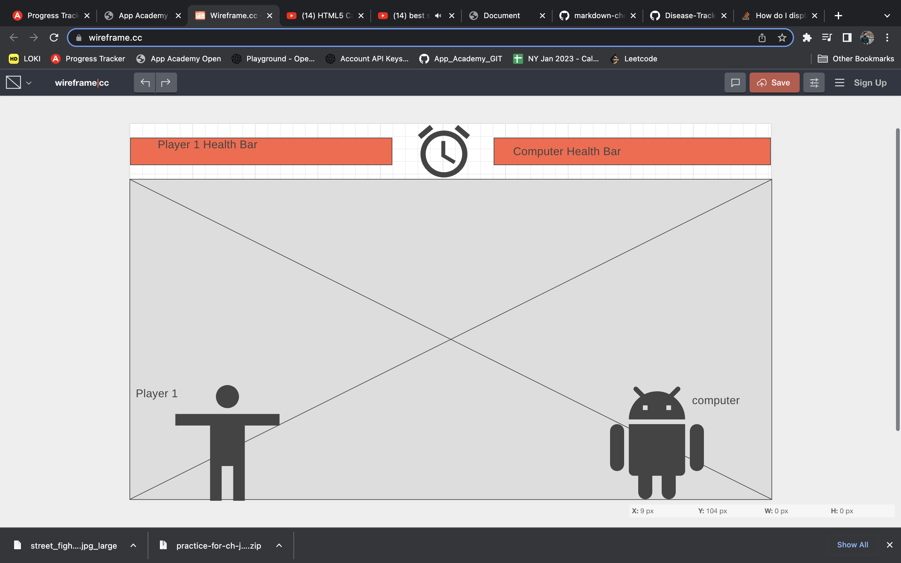

# Fight Game #

Fight game is a player vs computer game, where the user can take control of a character and face an AI character. The main idea of the game is to land significant strikes to your opponent, and this will in turn reduce their health bar. When their health bar reaches 0 they will lose the game. Receiving strikes from the opponent will have the same effect on the user's health bar. The game finishes, when one of the characters health reaches 0. The other way the game can finish is when the countdown timer reaches 0. The countdown timer will start at 2 minutes. In the game the user has absolute control over their character. You can use your character to left, right and jump. You will also have designated keys to land punches and kicks to your opponent. 

