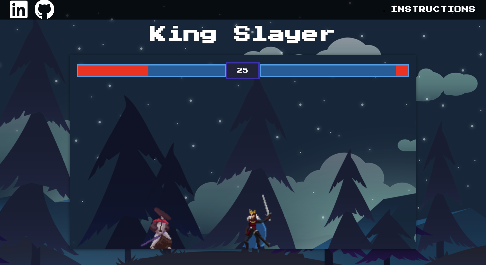
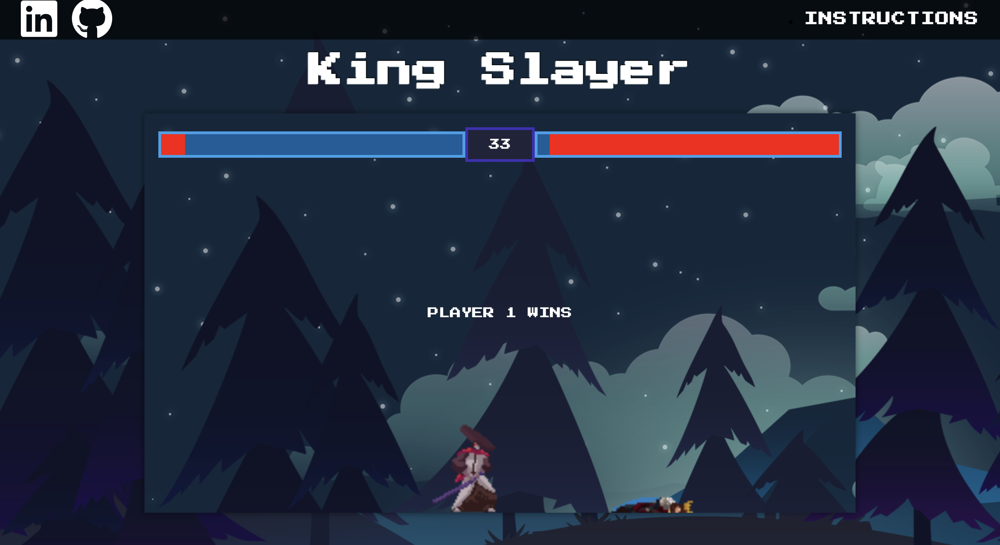
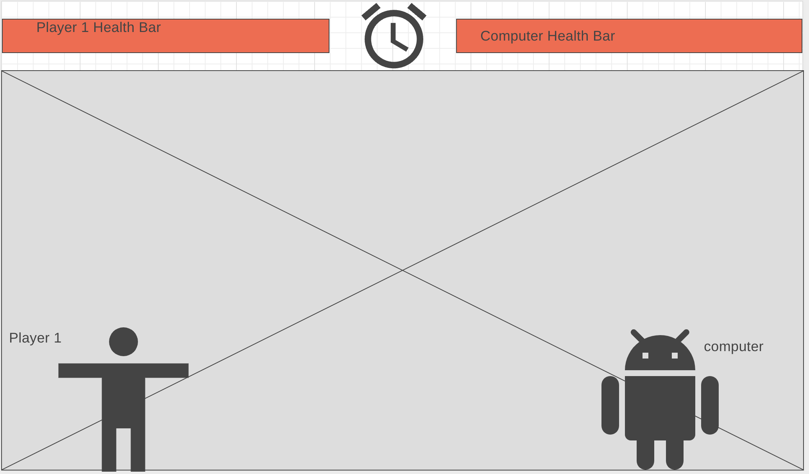

# King Slayer #

[LIVE LINK](https://jahinbhuiyan.github.io/JavaScript-Game/)







## Wireframe ##




## Background and Overview ##

King Slayer is an action game where the user takes control of one player and fights an AI opponent


## Functionality and MVPs ##
* User navigates the character using W,A,D
* User attacks using K
* Get in range to strike the opponent
* Health bar gets affected with every strike
* Receiving a strike reduces user health
* The game continues for 45 seconds
* Character with greater health at the end wins the game


## Technologies Used ##
JavaScript, Canvas, CSS, HTML

### Code to Initialize a player: ###
```js
const player = new Character("player", canvas,context, {    // creating the position and velocity as a key: value pair
        position:{
            x: 0, 
            y: 150 // so that we start at the bottom of the frame
        },
        velocity:{
            x: 0,
            y:0
        },
        color: 'green',

        offset:{
            x:0,
            y:0
        },
        imageSrc: 'assets/Martial/Sprites/Idle.png',
        framesMax: 8,
        scale: 2.5,
        offset: {
            x: 215,
            y: 157
        },
        sprites: {
            idle:{
                imageSrc: 'assets/Martial/Sprites/Idle.png',
                framesMax: 8
            },
            run:{
                imageSrc: 'assets/Martial/Sprites/Run.png',
                framesMax: 8,
                //image: new Image()
            },
            jump:{
                imageSrc: 'assets/Martial/Sprites/Jump.png',
                framesMax: 2,
                //image: new Image()
            },
            fall:{
                imageSrc: 'assets/Martial/Sprites/Fall.png',
                framesMax: 2,
                image: new Image()
            },
            attack1:{
                imageSrc: 'assets/Martial/Sprites/Attack1.png',
                framesMax: 6,
                //image: new Image()
            },
            takeHit:{
                imageSrc: 'assets/Martial/Sprites/TakeHit.png',
                framesMax: 4,
                //image: new Image()
            },
            death:{
                imageSrc: 'assets/Martial/Sprites/Death.png',
                framesMax: 6,
                //image: new Image()
            }
        },
        attackBox: {
            offset:{
                x: 0,
                y: 0
            },
            width: 200,
            height: 50
        }
    });
    
```
In the code above we are creating a new character(player). To create a player, the arguments required are name, canvas and context. We also pass in three objects as arguments position, velocity and offset. The color arguments sets the color of the player block in the back-end.
ImageSrc sets a default image for our character and framesMax is the number of frames that are available for that particular sprite in the sprite sheet. The offset and scale helps in positioning the sprite on top of the character block.

### Code for collision detection: ###

```js
function attackCollision(player1, player2){
       console.log(
        player1.attackRect.position.x + player1.attackRect.width >= player2.attackRect.position.x
            && 
            player1.attackRect.position.x <= player2.attackRect.position.x + player2.attackRect.width
            && 
            player1.attackRect.position.y + player1.attackRect.height >= player2.attackRect.position.y
            &&
            player1.attackRect.position.y <= player2.attackRect.position.y + player2.attackRect.height
            
       )
        
        return(
            player1.attackRect.position.x + player1.attackRect.width >= player2.attackRect.position.x
            && 
            player1.attackRect.position.x <= player2.attackRect.position.x + player2.attackRect.width
            && 
            player1.attackRect.position.y + player1.attackRect.height >= player2.attackRect.position.y
            &&
            player1.attackRect.position.y <= player2.attackRect.position.y + player2.attackRect.height
            
        )
    }
```
When the attackRect of the player overlaps that of the enemy and an attack is triggered by pressing "K", we can strike the other character.
When the attackRect of a character has completely moved past that of the other character(i.e. the characters have moved past each other), we cannot attack anymore.

### AI code: ###
```js
setInterval(()=>{
            
            
        function randomIntFromInterval(min, max) { // min and max included 
            return Math.floor(Math.random() * (max - min + 1) + min)
          }
          
          const rndInt = randomIntFromInterval(-1, 1)
          console.log(rndInt)
        if(enemy.health > 0){
            enemy.velocity.x =  rndInt
            enemy.attack()
        }else{
            enemy.velocity.x = 0
        }
        
    },1000)
```
We are creating the AI character in a way that it can attack at a random interval. The AI character also moves in random directions at intervals between -1 and 1. 
## Implementation and Timeline ##
* DAY 1 (3/09/23) - Project research
* DAY 2 (3/10/23) - Create canvas and two basic character
* DAY 3 (3/11/23) - Control user character with keyboard
* DAY 4 (3/12/23) - Collision detection
* DAY 5 (3/13/23) - Add sprites and set all animations
* DAY 6 (3/14/23) - Update collision detection to work in sync with sprites
* DAY 7 (3/15/23) - Build AI character (player 2)


## Future Directions ##

* Add more animations
* Improve collision 
* Add health regenerate


