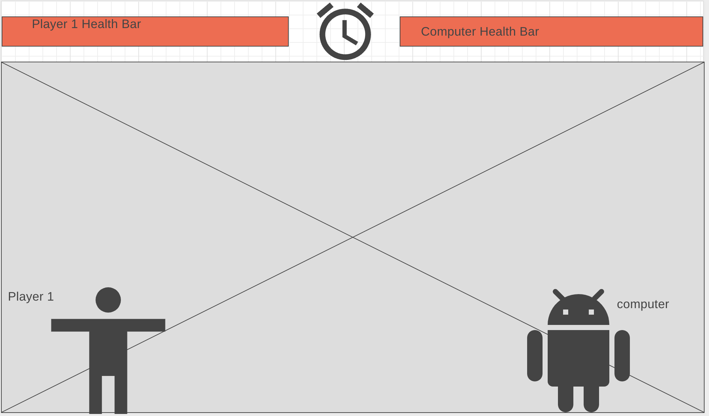

# Fight Game #

Fight game is a player vs computer game, where the user can take control of a character and face an AI character. The main idea of the game is to land significant strikes to your opponent, and this will in turn reduce their health bar. When their health bar reaches 0 they will lose the game. Receiving strikes from the opponent will have the same effect on the user's health bar. The game finishes, when one of the characters health reaches 0. The other way the game can finish is when the countdown timer reaches 0. The countdown timer will start at 2 minutes. In the game the user has absolute control over their character. You can use your character to left, right and jump. You will also have designated keys to land punches and kicks to your opponent. 

## Technologies Used ##
JavaScript, Canvas

## Work Schedule ##

1. Thursday - Final Proposal Submission and Research on technologies to use
2. Friday - Research and find character stickers for animation
3. Saturday - First day of coding. Build characters, add movement functionality
4. Sunday - Work on collision detection and animations for it
5. Monday - Work on health bar and timer
6. Tuesday - Fix all animations and character features
7. Wednesday - Final touches and edit all features
8. Thursday - Submission and Presentation 

## Future Features ##

In the future I want to add the ability to choose between multiple characters. I will also add more characteristics to  the user character: the character will have the ability to duck down to dodge an attack, after landing a certain number of strikes on the opponent the character will have the option to power up where they can use a special move to cause more damage to the opponent. I will also add health regenerate feature where the character's health slowly starts to regenerate if they haven't bit hit with a strike for a certain period of time. I will also add a leaderboard and I want to add multiple levels of difficulty to the game.